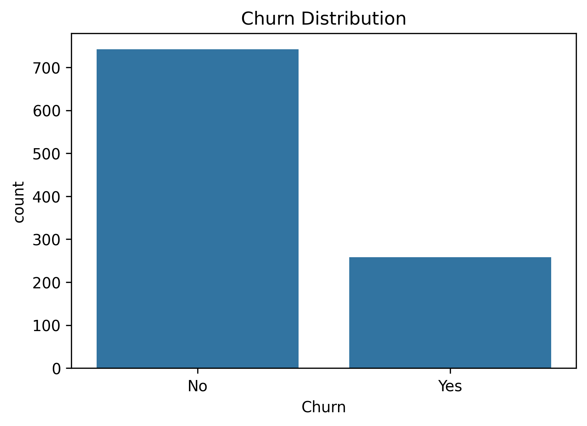
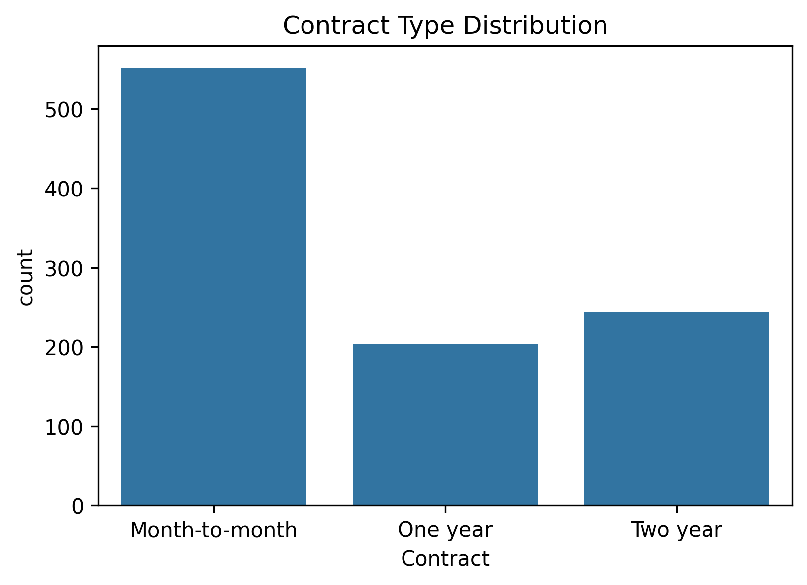

# Telco Churn Prediction Project

## Overview
This project predicts customer churn for a telecommunications company using:
- SQL for data cleaning & exploration
- Python (pandas, scikit-learn) for EDA & modeling
- Tableau / Power BI for dashboards

## Folder Structure
- **data/** → raw & cleaned datasets
- **notebooks/** → Jupyter notebooks for analysis
- **dashboards/** → Tableau & Power BI files
- **src/** → Python scripts
- **visuals/** → images, plots

## Tools Used
Python, MySQL, Tableau, Power BI, GitHub

## Author
Niveditha S Nair

# 📊 Telco Customer Churn Analysis  

This project analyzes **customer churn** for a Telco company using **SQL + Python (EDA + ML)**.  

## 📂 Project Structure  

## 🚀 Project Phases  

✅ **Phase 1** — Project Setup  
✅ **Phase 2** — Data Collection (Telco dataset)  
✅ **Phase 3** — Dashboarding (Tableau / Power BI)  
✅ **Phase 3.2** — Data Science Add-ons (Python setup, ML libraries)  
✅ **Phase 4** — SQL Data Exploration & Cleaning  
✅ **Phase 5** — Python EDA (plots, insights)  
🔜 **Phase 6** — Feature Engineering & Modeling (ML)  
🔜 **Phase 7** — Model Deployment  

## 🛠️ Tools & Tech  

- **SQL (MySQL)** → Data exploration, cleaning  
- **Python (pandas, numpy, matplotlib, seaborn)** → EDA  
- **Tableau / Power BI** → Dashboards  
- **Git & GitHub** → Version control, portfolio  

## 📌 Progress So Far  

- Imported dataset into SQL, handled missing values, exported clean CSV.  
- Performed **EDA in Python** with univariate & bivariate plots.  
- Stored all plots inside `/visuals`.  

## 📸 Sample Visuals  

Churn Distribution:  
  

Contract Type Distribution:  
  

---

👉 Next phase: **Feature Engineering + ML Modeling**  

## 🔮 Modeling (Phase 6)
- Built pipelines with preprocessing (impute/scale/one-hot) + models (LR, RF, XGB).
- Evaluated on hold-out test set using ROC-AUC, F1, PR/ROC curves, confusion matrix.
- Best model: <NAME> with ROC-AUC = <VALUE>.
- Saved artifact: `models/churn_model.pkl`; reports & plots in `/reports` and `/visuals`.

## 📊 Telco Churn Dashboard

This project includes a Tableau dashboard analyzing churn patterns.

- KPI: Overall Churn %
- Churn % by Contract Type
- Monthly Charges Distribution
- Interactive filters: Gender, Tenure, Senior Citizen

### 📷 Dashboard Preview

📄 [Download Full Dashboard (PDF)](visuals/churn_dashboard.pdf)

> Interactive version was built in Tableau Desktop (saved as visuals here).

